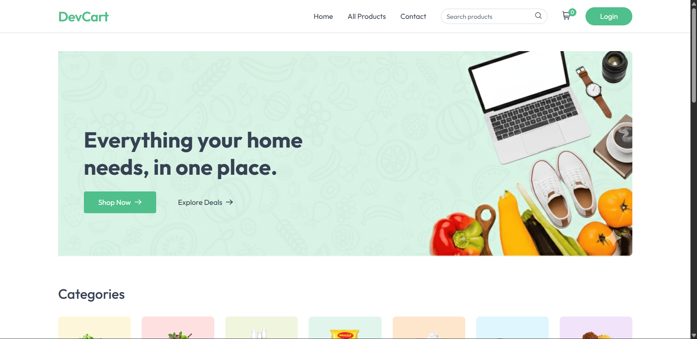
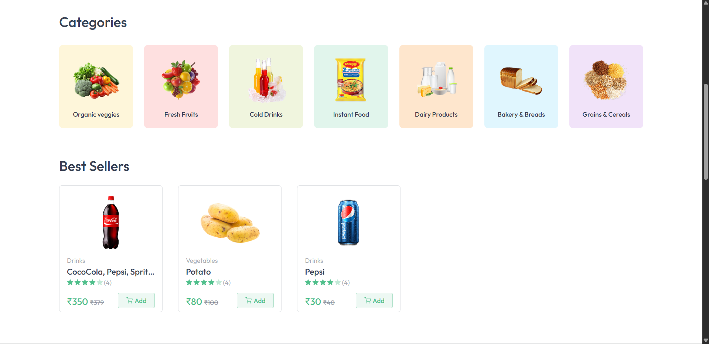
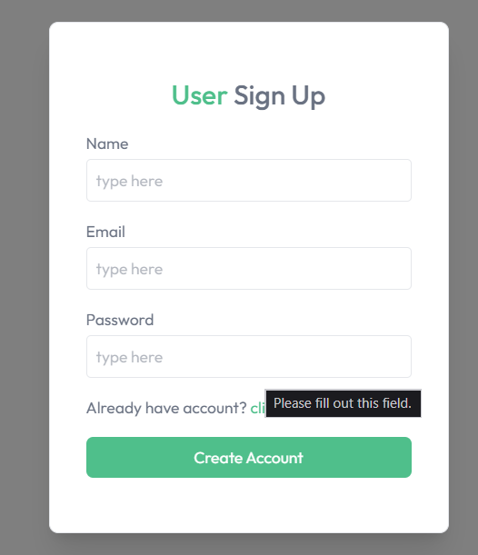
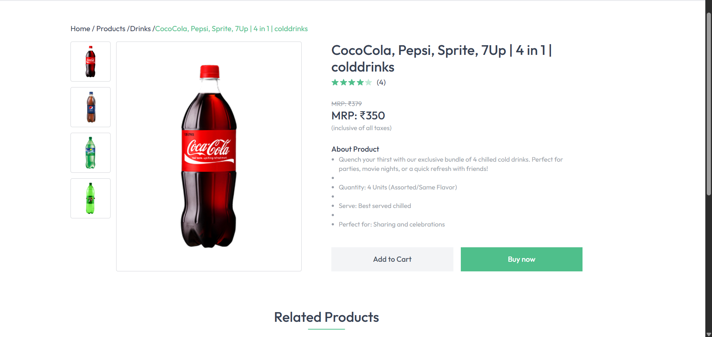
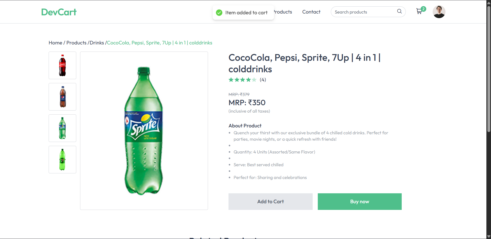
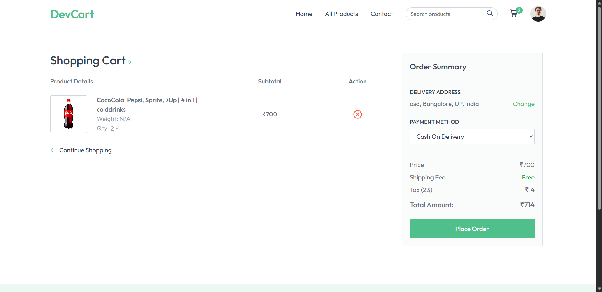
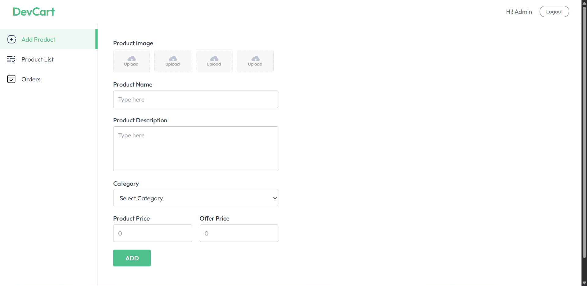
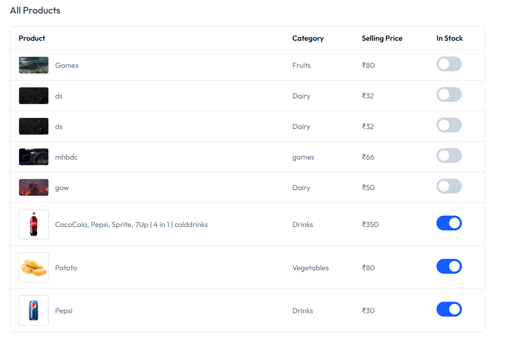
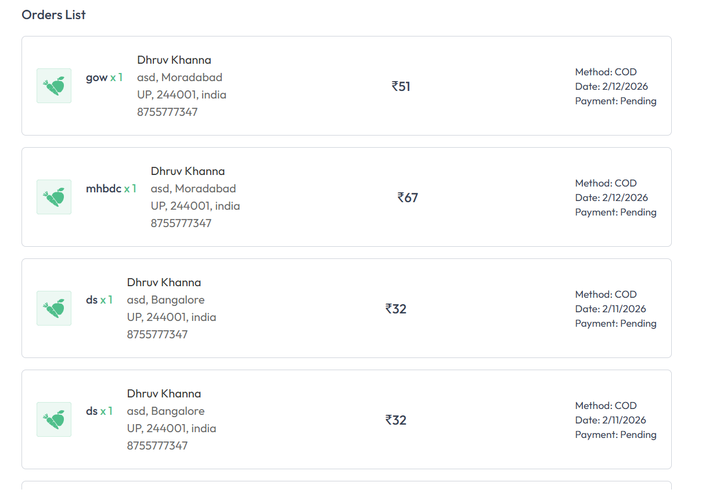
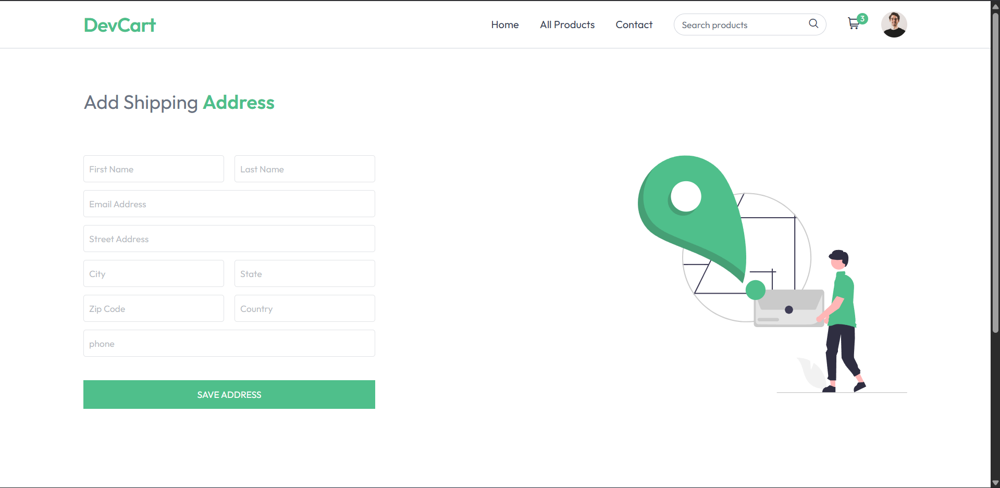

It looks like the formatting collapsed into a single block of text, which happens sometimes during copy-pasting. I have cleaned up the layout, restored the Markdown hierarchy, and ensured the technical sections are properly fenced.

-----

# DevCart

DevCart is a comprehensive e-commerce solution engineered for performance and scalability. The platform provides a streamlined shopping experience with a focus on clean architecture and responsive design.

## Overview

DevCart is a full-stack application designed to handle the complexities of modern online retail. From secure user authentication to dynamic inventory management and seamless payment integration, the platform is built to provide a robust infrastructure for digital commerce.

### Home Page


### Categories


### User Authentication


### Items page


### Add to cart


### Cart


### Admin signup page


### Admin page


### Inventory management


### Orders management


### User address form


## Key Features

  * **Secure Authentication:** Implementation of JWT-based authorization and secure session management.
  * **Dynamic Product Catalog:** Advanced filtering, category sorting, and full-text search capabilities.
  * **State-Persistent Cart:** A centralized state management system for real-time cart updates and persistence across sessions.
  * **Responsive UI:** A mobile-first approach ensuring compatibility across all device form factors.
  * **Admin Interface:** Comprehensive tools for product CRUD operations, order tracking, and user management.
  * **Payment Integration:** Secure checkout flow utilizing industry-standard payment gateways.

## Technical Architecture

| Component | Technology |
| :--- | :--- |
| **Frontend** | React.js / Next.js, Tailwind CSS, Redux/Context API |
| **Backend** | Node.js, Express.js |
| **Database** | MongoDB / PostgreSQL |
| **Authentication** | JSON Web Tokens (JWT) / OAuth |
| **Deployment** | Docker, AWS / Vercel |

## Installation and Deployment

### Prerequisites

  * Node.js (v16.x or higher)
  * npm or yarn
  * Database instance (Local or Cloud)

### Local Setup

1.  **Clone the Repository**

    ```bash
    git clone https://github.com/dhruvkhanna78/DevCart.git
    cd DevCart
    ```

2.  **Install Backend Dependencies**

    ```bash
    npm install
    ```

3.  **Install Frontend Dependencies**

    ```bash
    cd client
    npm install
    cd ..
    ```

4.  **Environment Configuration**
    Create a `.env` file in the root directory and configure the following:

    ```env
    PORT=5000
    DATABASE_URL=your_connection_string
    JWT_SECRET=your_secure_secret
    STRIPE_API_KEY=your_api_key
    ```

5.  **Execution**

    ```bash
    npm run dev
    ```

## API Documentation

The backend exposes a RESTful API. Key endpoints include:

  * `POST /api/auth/register` — User registration
  * `GET /api/products` — Retrieve all products
  * `POST /api/orders` — Create a new order
  * `PUT /api/admin/products/:id` — Update inventory (Admin only)

## Contribution Guidelines

To maintain code quality and consistency:

1.  Fork the repository.
2.  Create a feature branch: `git checkout -b feature/Optimization`.
3.  Ensure code adheres to existing linting rules.
4.  Submit a Pull Request with a detailed description of changes.

## License

This project is licensed under the MIT License. Refer to the `LICENSE` file for full details.

## Contact

**Dhruv Khanna** GitHub: [dhruvkhanna78](https://www.google.com/search?q=https://github.com/dhruvkhanna78)  
Project Link: [https://github.com/dhruvkhanna78/DevCart](https://github.com/dhruvkhanna78/DevCart)

-----

Would you like me to generate a specific **Folder Structure** tree to add to this README?